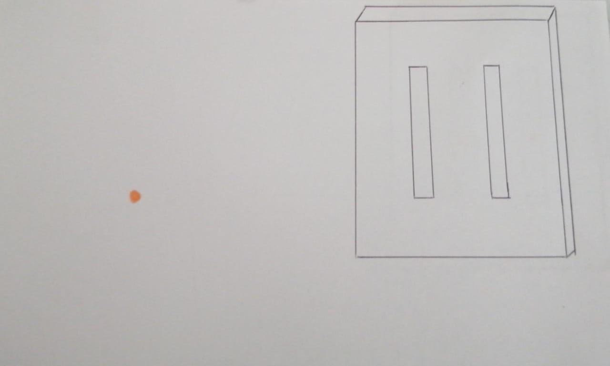
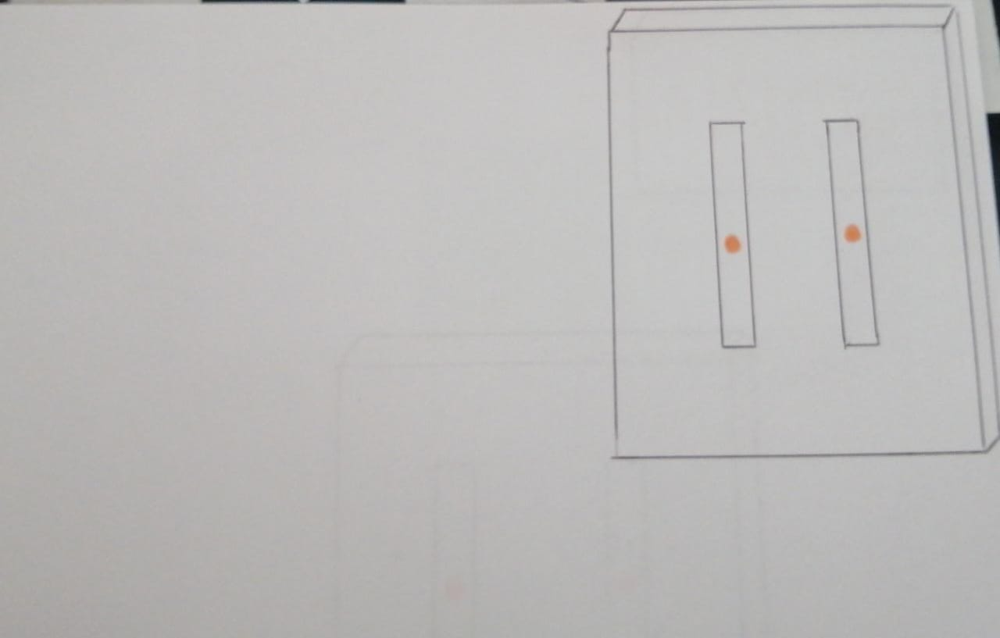
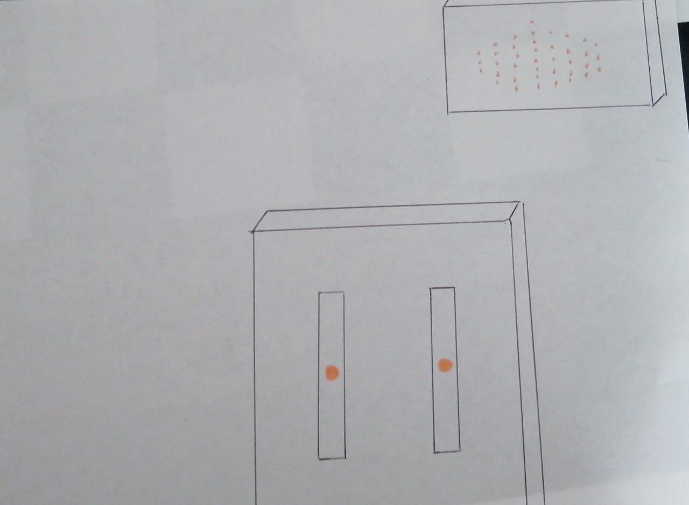
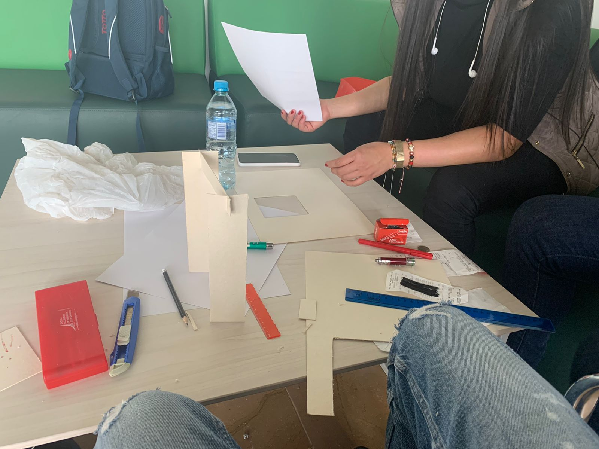
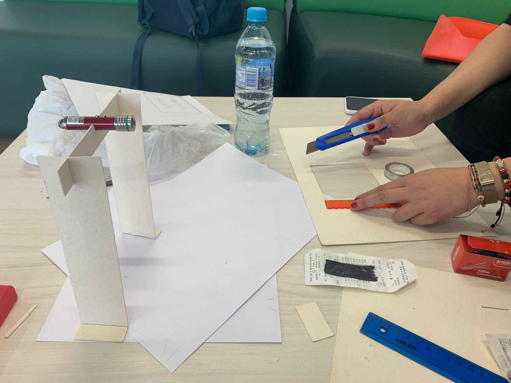
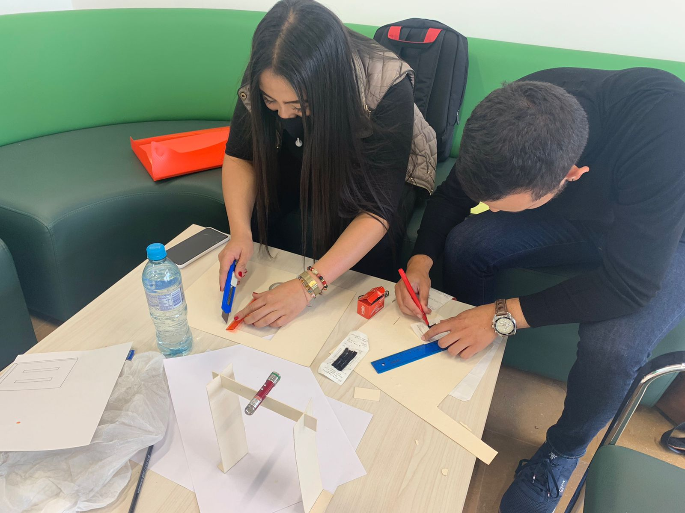
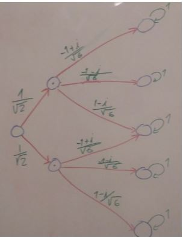

# Experimento de la doble rendija

## Integrantes 

* Santiago Monroy
* Nicole Franco
* Andres Felipe Davila Gutierrez

## Inicio

El experimento de la doble rendija fue planteado originalmente en 1801 por Thomas Young y lo hizo con la intención de determinar si la luz se comportaba como onda o como partícula, actualmente este experimento se repoduce en una cámara oscura la cual deja entrar un haz de luz por una rendija estrecha, cuando la luz llega a una pared intermedia de dos rendijas, la luz debe pasar por alguna de estas dos y chocar con una placa que se encuentra despues de la rendija .

* En la siguiente imagen se pude observar cómo es el comportamiento de las partículas en el experimento con un boceto.

* En un momento se explicara como funciona este fenomeno 

## Materiales del experimento

* Materiales:
	1. Laser
	2. Caja de zapatos
	3. 2/8 de carton paja
	4. Punta de lanza o alfiler
	5. Bisturi
	6. Papel
	7. Facturas o aluminio
	

## Primeros Pasos del expermiento

* Se realizaron cortes al cartón paja, para crear un soporte en el cual se colocaría el láser, este soporte a su vez se fijaría a una base para que no se moviera.
* La base sera la caja de zapatos donde se realizara el expermiento y sus lados se usaran para sostener la rendija y donde se pondra un papel para ver el resultado final
* Para la construccion de la rendija esta se puede realizar de dos formas la primera es utilizando una lamina de vidrio de microscopio, esta se envuelve en aluminio,previo a esto se deben realizar las aberturas con el alfiler del lado fino del aluminio para que este no se rompa, la segunda forma es utilizandopapel blanco, en este caso facturas pinta de negro la factura y realizar las rendijas con el alfiler de forma que sean lineas perpendiculares a la base en los dos casos 

## Proceso
/Images/Montaje1.jpeg

## Desarollo del experimento

 Para realizar la simulación del experimento se debe apuntar un con un láser ala rendija montada desde el montaje que se hubiera realizado según lo observado se ve que el resultado se asemeja más al comportamiento de ondas con el patrón de interferencia,pero en la época en la que se realizo este experimento desconserto a los cientificos. Un hecho muy importante es que al poner detectores después de la rendija para saber por dónde pasaba la luz el patrón del experimento era equivalente al de las partículas, lo que nos da entender que cuando el experimento está siendo monitoreado nos da como resultado el de las partículas y cuando no el resultado es el de patrón de interferencia de las ondas, como se muestra a continuación: 

 A continuación un vistazo con mas detalle sobre el experimento realizado, en el siguiente enlace 

## Sistema
* Antes de seguir se debe tener en cuenta la forma en que el experimento sera representado como un sistema cuantico, este sistema tendra una matriz de adyacencia asociada y un vector el cual representara el estado inicial del sistema, donde sus posiciones representaran el peso de una conexion especifica entre componentes del sistema, a continuacion se mostrar un ejemplo del sistema cuantico para el experimento de la doble rendija.

## Simulación del experimento

